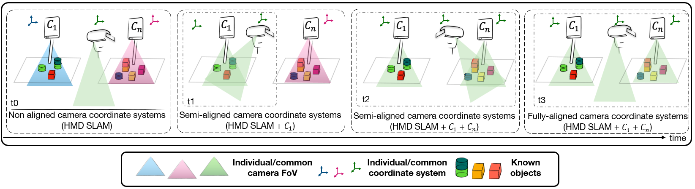

# MultiCam: On-the-fly Multi-Camera Pose Estimation Using Spatiotemporal Overlaps of Known Objects

    

## Publication

Official code of paper GBOT: Graph-Based 3D Object Tracking for Augmented Reality-Assisted Assembly Guidance (IEEE VR 2026)

## Introduction

Multi-camera dynamic Augmented Reality (AR) applications require a camera pose estimation to leverage individual information from each camera in one common system. To overcome these limitations of marker-based methods, we propose a constant dynamic camera pose estimation leveraging spatiotemporal FoV overlaps of known objects on the fly. To achieve that, we enhance the state-of-the-art object pose estimator to update our spatiotemporal scene graph, enabling a relation even among non-overlapping FoV cameras. To evaluate our approach, we introduce a multi-camera, multi-object pose estimation dataset with temporal FoV overlap, including static and dynamic cameras. Furthermore, in FoV overlapping scenarios, we outperform the state-of-the-art on the widely used YCB-V and T-LESS dataset in camera pose accuracy. Our performance on both previous and our proposed datasets validates the effectiveness of our marker-less approach for AR applications.

<a href="https://www.youtube.com/watch?v=O-o3Y0Mzrw4">

 
      
    <em>IEEE VR presentation</em>

</a>

## Code and dataset
Code and dataset will be published before April 15th, 2026
